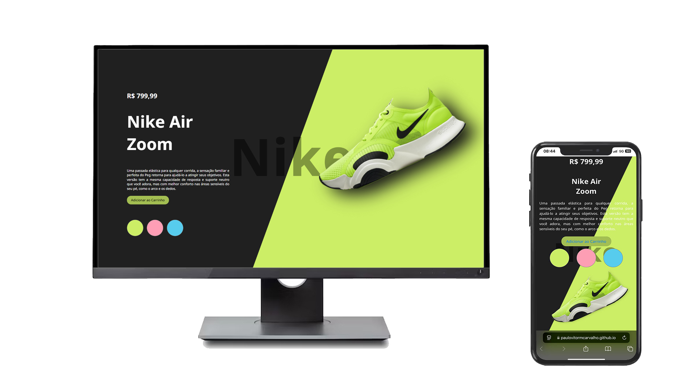

# 👟 Projeto Nike - Desafio Programador em 72h | DevClub

Esse projeto foi feito como parte do desafio **Programador em 72h** do [DevClub](https://www.youtube.com/@canaldevclub), com a orientação do professor **Rodolfo Mori**. A proposta era criar uma landing page da Nike usando **HTML**, **CSS** e **JavaScript**.

---

## 💻 O que rolou nesse projeto

Aqui eu coloquei em prática várias coisas que venho aprendendo:

- Estruturação com HTML semântico
- Estilização com CSS moderno (cores, gradientes, sombras)
- Responsividade total (funciona bem no celular e no PC)
- Interações com JavaScript
- Código mais limpo e organizado

---

## 🔧 O que eu melhorei

- Adicionei **responsividade** pra funcionar bem em qualquer tela  
- Organizei melhor o HTML e CSS  
- Melhorei a semântica do código  
- Dei uma ajustada no layout pra deixar mais bonito e usável

---

## 🔗 Onde acessar

- 🌐 **Página online:** [Clique aqui](https://paulovitormcarvalho.github.io/Projeto_Site_Nike/)  
- 📂 **Código no GitHub:** [Repositório](https://github.com/paulovitormcarvalho/Projeto_Site_Nike)

---

## 🛠️ Tecnologias usadas

  
  
  

---

## 📸 Como ficou?

### 💻 Versão Desktop e Mobile

---

## 🙌 Agradecimento

Valeu demais ao **DevClub** e ao **Rodolfo Mori** por mais esse desafio que me ajudou a evoluir na prática!

---

## 📲 Me encontra por aí

Se quiser trocar uma ideia ou acompanhar meus projetos, dá uma olhada no meu [LinkedIn](https://www.linkedin.com/in/paulovitormcarvalho/) ou segue aqui no GitHub mesmo!

---

⭐ Se curtir o projeto, deixa uma estrela no repositório!
